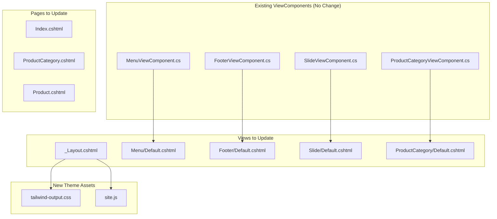

# Design Document

## Overview

این سند طراحی فرانت‌اند فروشگاه آپشن خودرو را شرح می‌دهد. طراحی بر اساس تم موجود در `front_car_store/simple_front` با Tailwind CSS، تم تاریک (Dark Mode) و پشتیبانی کامل از RTL فارسی انجام می‌شود. 

سیستم با پروژه ASP.NET Core Razor Pages موجود در `Code/Lampshade/ServiceHost` یکپارچه خواهد شد و از ساختار ViewComponent های موجود استفاده می‌کند.

### Design Goals
- جایگزینی تم فعلی (MVC_Project_Theme) با تم جدید آپشن خودرو
- شخصی‌سازی برای سه دسته‌بندی: مانیتور، دوربین، فریم
- حفظ ساختار ViewComponent های موجود
- استفاده از Tailwind CSS به جای Bootstrap

## Architecture

### Current Project Structure (Existing)

```
Code/Lampshade/ServiceHost/
├── Pages/
│   ├── Shared/
│   │   ├── _Layout.cshtml              # لایه‌آوت اصلی (نیاز به تغییر)
│   │   └── Components/
│   │       ├── Menu/Default.cshtml     # هدر (نیاز به تغییر)
│   │       ├── Footer/Default.cshtml   # فوتر (نیاز به تغییر)
│   │       ├── Slide/Default.cshtml    # اسلایدر (نیاز به تغییر)
│   │       ├── ProductCategory/Default.cshtml
│   │       ├── ProductCategoryWithProduct/Default.cshtml
│   │       ├── LatestArrivals/Default.cshtml
│   │       └── LatestArticles/Default.cshtml
│   ├── Index.cshtml                    # صفحه اصلی (نیاز به تغییر)
│   ├── ProductCategory.cshtml          # صفحه دسته‌بندی (نیاز به تغییر)
│   └── Product.cshtml                  # صفحه جزئیات (نیاز به تغییر)
├── ViewComponents/
│   ├── MenuViewComponent.cs            # بدون تغییر
│   ├── FooterViewComponent.cs          # بدون تغییر
│   ├── SlideViewComponent.cs           # بدون تغییر
│   └── ProductCategoryViewComponent.cs # بدون تغییر
└── wwwroot/
    └── Theme/                          # تم جدید اینجا اضافه می‌شود
        └── CarOption/
            ├── css/
            │   └── tailwind-output.css
            └── js/
                └── site.js
```

### High-Level Architecture



## Components and Interfaces

### 1. Layout (_Layout.cshtml)

تغییر از Bootstrap به Tailwind CSS با تم تاریک.

**Current:**
```html
<link href="~/Theme/assets/css/vendors.css" rel="stylesheet">
<link href="~/Theme/assets/css/style.css" rel="stylesheet">
```

**New:**
```html
<script src="https://cdn.tailwindcss.com"></script>
<script>
  tailwind.config = {
    darkMode: "class",
    theme: {
      extend: {
        colors: {
          "primary": "#0d7ff2",
          "background-dark": "#101922",
          "surface-dark": "#182634",
          "border-dark": "#314d68",
          "text-secondary": "#90adcb",
        },
        fontFamily: {
          "display": ["Vazirmatn", "Inter", "sans-serif"],
        },
      },
    },
  }
</script>
```

### 2. Menu Component (Menu/Default.cshtml)

**Existing Model (No Change):**
```csharp
// از _01_LampshadeQuery.MenuModel استفاده می‌شود
public class MenuModel
{
    public List<ProductCategoryQueryModel> ProductCategories { get; set; }
    public List<ArticleCategoryQueryModel> ArticleCategories { get; set; }
}
```

**New View Structure:**
- هدر sticky با backdrop-blur
- لوگو با آیکون directions_car
- منوی ناوبری با سه دسته‌بندی (مانیتور، دوربین، فریم)
- باکس جستجو در مرکز
- آیکون سبد خرید با شمارنده
- دکمه ورود/ثبت‌نام
- منوی موبایل با همبرگر

### 3. ProductCategory Component (ProductCategory/Default.cshtml)

**Existing Model (No Change):**
```csharp
public class ProductCategoryQueryModel
{
    public long Id { get; set; }
    public string Name { get; set; }
    public string Picture { get; set; }
    public string PictureAlt { get; set; }
    public string PictureTitle { get; set; }
    public string Slug { get; set; }
    public string Description { get; set; }
    public List<ProductQueryModel> Products { get; set; }
}
```

**New View Structure:**
- کارت‌های دسته‌بندی با تصویر و hover effect
- نمایش تعداد محصولات هر دسته‌بندی
- طراحی گرید ریسپانسیو

### 4. Product Card (Partial View - New)

**Model (Existing):**
```csharp
public class ProductQueryModel
{
    public long Id { get; set; }
    public string Picture { get; set; }
    public string PictureAlt { get; set; }
    public string PictureTitle { get; set; }
    public string Name { get; set; }
    public string Price { get; set; }
    public string PriceWithDiscount { get; set; }
    public int DiscountRate { get; set; }
    public bool HasDiscount { get; set; }
    public string Slug { get; set; }
    public string Category { get; set; }
    public string CategorySlug { get; set; }
    public bool IsInStock { get; set; }
}
```

**New View Structure:**
- تصویر با aspect-ratio 4:3
- برچسب تخفیف یا جدید
- دکمه‌های علاقه‌مندی و مقایسه (hover)
- نام محصول با hover effect
- قیمت با نمایش تخفیف
- امتیاز ستاره‌ای
- دکمه افزودن به سبد

### 5. ProductCategory Page (ProductCategory.cshtml)

**Existing Model (No Change):**
```csharp
public class ProductCategoryModel : PageModel
{
    public ProductCategoryQueryModel ProductCategory { get; set; }
}
```

**New View Structure:**
- Breadcrumb navigation
- سایدبار فیلترها:
  - فیلتر دسته‌بندی
  - فیلتر برند خودرو (ایران خودرو، سایپا، هیوندای، کیا)
  - فیلتر مدل خودرو
  - فیلتر بازه قیمت
- گرید محصولات (3 ستون در دسکتاپ)
- مرتب‌سازی (پرفروش‌ترین، جدیدترین، ارزان‌ترین، گران‌ترین)
- صفحه‌بندی

### 6. Product Detail Page (Product.cshtml)

**Existing Model (No Change):**
```csharp
public class ProductQueryModel
{
    // ... همان مدل موجود
    public string Code { get; set; }
    public string ShortDescription { get; set; }
    public string Description { get; set; }
    public List<ProductPictureQueryModel> Pictures { get; set; }
    public List<CommentQueryModel> Comments { get; set; }
}
```

**New View Structure:**
- گالری تصاویر با thumbnail
- اطلاعات محصول (نام، کد، قیمت، موجودی)
- امتیاز و تعداد دیدگاه
- دکمه افزودن به سبد
- لیست خودروهای سازگار (جدید - نیاز به فیلد در مدل)
- تب‌های توضیحات، مشخصات فنی، دیدگاه‌ها
- محصولات مشابه

## Data Models

### Existing Models (No Change Required)

پروژه از مدل‌های موجود در `01_LampshadeQuery` استفاده می‌کند:

- `ProductCategoryQueryModel` - اطلاعات دسته‌بندی
- `ProductQueryModel` - اطلاعات محصول
- `SlideQueryModel` - اطلاعات اسلاید
- `MenuModel` - اطلاعات منو

### New/Extended Models (Optional)

برای فیلتر برند خودرو، می‌توان در آینده مدل زیر را اضافه کرد:

```csharp
public class CarBrandFilterModel
{
    public string Brand { get; set; }      // ایران خودرو، سایپا، ...
    public string Model { get; set; }      // پژو 206، پراید، ...
}
```

## Correctness Properties

*A property is a characteristic or behavior that should hold true across all valid executions of a system-essentially, a formal statement about what the system should do. Properties serve as the bridge between human-readable specifications and machine-verifiable correctness guarantees.*

### Property 1: Page Layout Consistency
*For any* page in the application, the rendered HTML should contain a header element with logo, navigation menu, search box, and cart icon, as well as a footer element with contact information and copyright.
**Validates: Requirements 2.1, 7.1**

### Property 2: Price Filter Correctness
*For any* price range filter applied to a product list, all displayed products should have prices within the specified minimum and maximum range.
**Validates: Requirements 3.2**

### Property 3: Sort Order Correctness
*For any* sort option selected (newest, cheapest, expensive, bestseller), the product list should be ordered according to the selected criterion in the correct ascending or descending order.
**Validates: Requirements 3.3**

### Property 4: Pagination Threshold
*For any* product list with more than 12 items, the pagination component should be visible and functional.
**Validates: Requirements 3.4**

### Property 5: Product Card Information Completeness
*For any* product card rendered in the application, it should display the product image, name, price, and category.
**Validates: Requirements 4.1**

### Property 6: Discount Display Correctness
*For any* product with a discount (HasDiscount = true), the product card and detail page should display both the original price (strikethrough) and the discounted price.
**Validates: Requirements 4.2**

### Property 7: Product Detail Information Completeness
*For any* product detail page, it should display the product name, price, product code, stock status (IsInStock), and description.
**Validates: Requirements 5.2**

## Error Handling

### UI Error States
- **Empty State**: نمایش پیام "محصولی یافت نشد" وقتی لیست محصولات خالی است
- **Loading State**: نمایش اسکلتون در حین بارگذاری (اختیاری)
- **Image Error**: نمایش تصویر placeholder در صورت خطای بارگذاری تصویر

### Form Validation
- اعتبارسنجی فیلدهای فیلتر قیمت (فقط عدد)
- اعتبارسنجی فیلد جستجو (حداقل ۲ کاراکتر)

## Testing Strategy

### Dual Testing Approach

این پروژه از دو رویکرد تست استفاده می‌کند:

#### Unit Tests
- تست صحت نمایش داده‌ها در ViewComponents
- تست helper methods

#### Property-Based Tests
- استفاده از کتابخانه **FsCheck** برای .NET
- هر property test حداقل ۱۰۰ iteration اجرا می‌شود
- هر تست با کامنت به property مربوطه در design document لینک می‌شود
- فرمت تگ: `**Feature: car-accessories-frontend, Property {number}: {property_text}**`

### Test Categories

1. **Layout Tests**: تست وجود المان‌های اصلی در همه صفحات
2. **Filter Tests**: تست صحت فیلتر قیمت
3. **Sort Tests**: تست صحت مرتب‌سازی محصولات
4. **Component Tests**: تست کارت محصول و صفحه جزئیات

## Implementation Notes

### Files to Modify

1. **wwwroot/Theme/CarOption/** - ایجاد پوشه تم جدید
2. **Pages/Shared/_Layout.cshtml** - تغییر به Tailwind CSS
3. **Pages/Shared/Components/Menu/Default.cshtml** - طراحی جدید هدر
4. **Pages/Shared/Components/Footer/Default.cshtml** - طراحی جدید فوتر
5. **Pages/Shared/Components/Slide/Default.cshtml** - طراحی جدید اسلایدر
6. **Pages/Shared/Components/ProductCategory/Default.cshtml** - طراحی جدید کارت دسته‌بندی
7. **Pages/Index.cshtml** - طراحی جدید صفحه اصلی
8. **Pages/ProductCategory.cshtml** - طراحی جدید با فیلتر و سایدبار
9. **Pages/Product.cshtml** - طراحی جدید صفحه جزئیات

### Files NOT to Modify

- ViewComponent های C# (MenuViewComponent.cs, etc.)
- Query Contracts و Models
- Application و Domain layers
- Database و Migrations

### Color Palette (from front_car_store)

```css
--primary: #0d7ff2;
--background-dark: #101922;
--surface-dark: #182634;
--border-dark: #314d68;
--text-secondary: #90adcb;
```

### Font

- فونت فارسی: Vazirmatn (از Google Fonts)
- فونت انگلیسی: Inter
